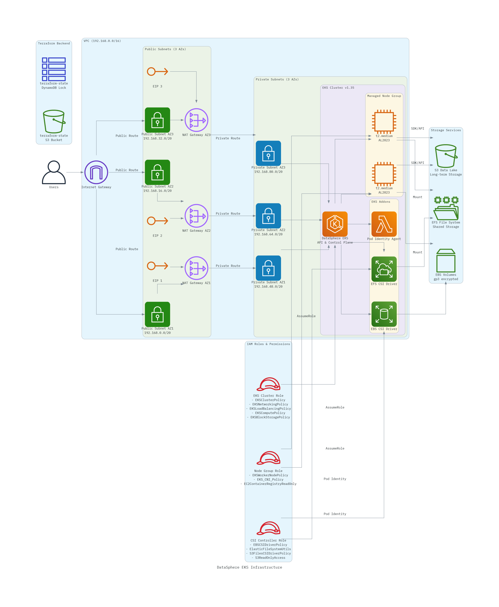

# DataSphere: Learning EKS and CSI Driver
A hands-on Terraform project for learning AWS EKS and container storage integration.

This project deploys a multi-AZ EKS cluster with EBS and EFS CSI drivers, demonstrating production-ready patterns for networking, security, and persistent storage in Kubernetes.

# Prerequisites
- [Terraform](https://www.terraform.io/downloads) v1.14.9 or greater
- [AWS CLI](https://aws.amazon.com/cli/) installed and configured with credentials
- [kubectl](https://kubernetes.io/docs/tasks/tools/) installed for cluster management
- AWS account with permissions to create:
  - VPC, Subnets, NAT Gateways, Internet Gateways
  - EKS clusters and node groups
  - IAM roles and policies
  - Elastic IPs
- S3 bucket and DynamoDB table for Terraform state backend (see Configuration below)

# Project Structure
```
DataSphere
├── main.tf # Main terraform file, contains global configurations
├── modules # Stores AWS modules
│   ├── compute # Stores modules related to computing
│   │   └── eks
│   │       ├── main.tf
│   │       ├── output.tf
│   │       └── variables.tf
│   ├── networking # Stores modules related to network
│   │   └── vpc
│   │       ├── main.tf
│   │       ├── output.tf
│   │       └── variables.tf
│   └── security # Stores modules related to security
│       ├── iam
│       │   ├── main.tf
│       │   ├── output.tf
│       │   └── variables.tf
│       └── kms
│           ├── main.tf
│           ├── output.tf
│           └── variables.tf
├── output.tf # Outputs mandatory global variables
├── pyproject.toml
├── README.md # DataSphere's Documentation
├── TASK.md # Task that originated DataSphere
└── variables.tf # Global Variables
```
# Infrastructure Diagram


# Infrastructure Description
## Compute
- EKS Cluster
  - 1x EKS cluster (version 1.35)
    - Authentication mode: API_AND_CONFIG_MAP
    - Endpoint access: Both private and public enabled
    - Deployed in private subnets across 3 AZs
    - Bootstrap self-managed addons enabled
  - Node Groups
    - 1x managed node group (general purpose)
      - Instance type: t2.medium
      - AMI: Amazon Linux 2023 (AL2023_x86_64_STANDARD)
      - Scaling: Min 1, Desired 1, Max 2 nodes
      - Deployed in private subnets
  - EKS Addons
    - 3x addons
      - AWS EBS CSI Driver (for persistent block storage)
      - AWS EFS CSI Driver (for persistent file storage)
      - EKS Pod Identity Agent
  - Pod Identity Associations
    - 2x pod identity associations for CSI drivers
      - Namespace: kube-system
      - Service accounts: ebs-csi-controller-sa, efs-csi-controller-sa

## Networking
- VPC
  - 1x VPC using a /16 CIDR block
  - Subnets
    - 6x subnets using a /20 CIDR block 
      - 3x private subnets (1 per AZ)
      - 3x public subnets (1 per AZ)
  - Route Tables
    - 4x route tables
      - 3x private route tables with 0.0.0.0 destination pointing to a zonal NAT Gateway (1 per AZ, associated with private subnets)
      - 1x public route table with 0.0.0.0 destination pointing to an Internet Gateway (associated with public subnets)
  - Internet Gateway
    - 1x Internet Gateway
  - NAT Gateways
    - 3x zonal NAT Gateways (1 per AZ, attached to public subnets)
  - Elastic IP Addresses
    - 3x Elastic IPs used for NAT Gateways

## Security
- IAM
  - 4x IAM Roles
    - CSI Controller Role
      - Attached to CSI addons. Contains the following trust policy:
        ```json
        {
          "Version": "2012-10-17",
          "Statement": [
            {
              "Action": [
                "sts:AssumeRole",
                "sts:TagSession"
              ],
              "Effect": "Allow",
              "Principal": {
                "Service": "pods.eks.amazonaws.com"
              }
            }
          ]
        }
        ```
      - AWS managed policies attached to this role:
        - AmazonEBSCSIDriverPolicy: `arn:aws:iam::aws:policy/service-role/AmazonEBSCSIDriverPolicy`
        - AmazonElasticFileSystemsUtils: `arn:aws:iam::aws:policy/AmazonElasticFileSystemsUtils`
        - AmazonS3FilesCSIDriverPolicy: `arn:aws:iam::aws:policy/service-role/AmazonS3FilesCSIDriverPolicy`
        - AmazonS3ReadOnlyAccess: `arn:aws:iam::aws:policy/AmazonS3ReadOnlyAccess`
  
    - EKS Node Group Role
      - Attached to EKS Node Groups. Contains the following trust policy:
        ```json
        {
          "Version": "2012-10-17",
          "Statement": [
            {
              "Effect": "Allow",
              "Principal": {
                "Service": "ec2.amazonaws.com"
              },
              "Action": "sts:AssumeRole"
            }
          ]
        }
        ```
      - AWS managed policies attached to this role:
        - AmazonEC2ContainerRegistryReadOnly: `arn:aws:iam::aws:policy/AmazonEC2ContainerRegistryReadOnly`
        - AmazonEKS_CNI_Policy: `arn:aws:iam::aws:policy/AmazonEKS_CNI_Policy`
        - AmazonEKSWorkerNodePolicy: `arn:aws:iam::aws:policy/AmazonEKSWorkerNodePolicy`
        - AmazonElasticContainerRegistryPublicReadOnly: `arn:aws:iam::aws:policy/AmazonElasticContainerRegistryPublicReadOnly`

    - EKS Cluster Role
      - Attached to EKS cluster. Contains the following trust policy:
        ```json
              {
          "Version": "2012-10-17",
          "Statement": [
            {
              "Effect": "Allow",
              "Principal": {
                "Service": "eks.amazonaws.com"
              },
              "Action": "sts:AssumeRole"
            }
          ]
        }
        ```
      - AWS managed policies attached to this role:
        - AmazonEKSNetworkingPolicy: `arn:aws:iam::aws:policy/AmazonEKSNetworkingPolicy`
        - AmazonEKSLoadBalancingPolicy: `arn:aws:iam::aws:policy/AmazonEKSLoadBalancingPolicy`
        - AmazonEKSComputePolicy: `arn:aws:iam::aws:policy/AmazonEKSComputePolicy`
        - AmazonEKSClusterPolicy: `arn:aws:iam::aws:policy/AmazonEKSClusterPolicy`
        - AmazonEKSBlockStoragePolicy: `arn:aws:iam::aws:policy/AmazonEKSBlockStoragePolicy`

    - EKS Auto Node Role
      - Attached to auto-scaling nodes. Contains the following trust policy:
        ```json
        {
          "Version": "2012-10-17",
          "Statement": [
            {
              "Effect": "Allow",
              "Principal": {
                "Service": "ec2.amazonaws.com"
              },
              "Action": "sts:AssumeRole"
            }
          ]
        }
        ```
      - AWS managed policies attached to this role:
        - AmazonEC2ContainerRegistryPullOnly: `arn:aws:iam::aws:policy/AmazonEC2ContainerRegistryPullOnly`
        - AmazonEKSWorkerNodeMinimalPolicy: `arn:aws:iam::aws:policy/AmazonEKSWorkerNodeMinimalPolicy`
        - AmazonElasticContainerRegistryPublicReadOnly: `arn:aws:iam::aws:policy/AmazonElasticContainerRegistryPublicReadOnly`

# Deploy
## Configuration
Before deploying, configure the Terraform backend in `main.tf`:

```hcl
backend "s3" {
  bucket         = "your-terraform-state-bucket"  # Replace with your S3 bucket
  key            = "terraform.tfstate"
  region         = "us-east-1"
  dynamodb_table = "your-terraform-lock-table"    # Replace with your DynamoDB table
}
```

Optionally, customize variables in `variables.tf` or create a `terraform.tfvars` file:
```hcl
aws_region   = "us-east-1"    # Default: us-east-1
project_name = "datasphere"   # Default: datasphere
environment  = "dev"          # Default: dev
```

## Deployment Steps
Initialize Terraform and download required providers:
```bash
terraform init
```

Validate your configuration:
```bash
terraform validate
```

Plan the changes before applying them:
```bash
terraform plan
```

Apply the changes if the resources meet your requirements:
```bash
terraform apply
```

## Post-Deployment
After successful deployment, configure kubectl to connect to your EKS cluster:

```bash
aws eks update-kubeconfig --region us-east-1 --name datasphere-eks-cluster
```

Verify the cluster is accessible:
```bash
kubectl get nodes
```

Check that CSI drivers are running:
```bash
kubectl get pods -n kube-system | grep csi
```

You should see pods for:
- `ebs-csi-controller`
- `ebs-csi-node`
- `efs-csi-controller`
- `efs-csi-node`

Test EBS CSI driver with a sample PersistentVolumeClaim:
```yaml
apiVersion: v1
kind: PersistentVolumeClaim
metadata:
  name: ebs-claim
spec:
  accessModes:
    - ReadWriteOnce
  storageClassName: gp3
  resources:
    requests:
      storage: 4Gi
```

Apply and verify:
```bash
kubectl apply -f pvc.yaml
kubectl get pvc ebs-claim
```

## Cleanup
To destroy all resources:
```bash
terraform destroy
```

**Warning:** Ensure all PersistentVolumes created by the CSI drivers are deleted before running `terraform destroy`, otherwise EBS volumes may remain orphaned.